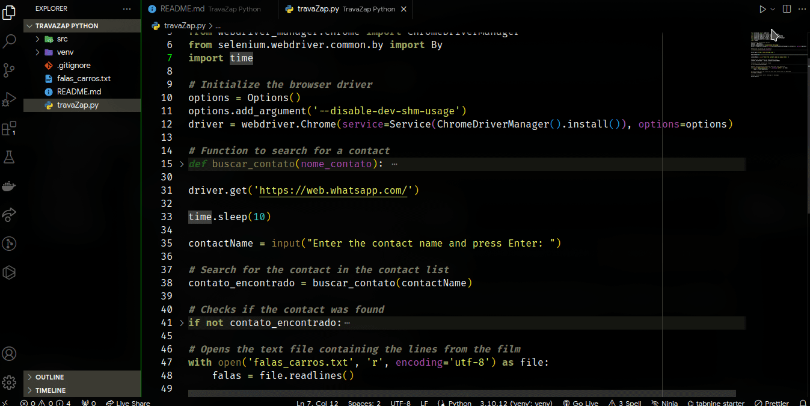

<h1 align="center">TravaZap</h1>

# About the project

TravaZap is a Python project to automate sending WhatsApp messages to an informed contact.
In this project, he searches for the contact entered in the terminal, and sends the entire speech script for the film Cars

## Project presentation

# Extra technologies used

## Libs

- selenium: Selenium is a portable framework for testing web applications.

# Author

Made with 💜 by Guilherme Bafica 👋

